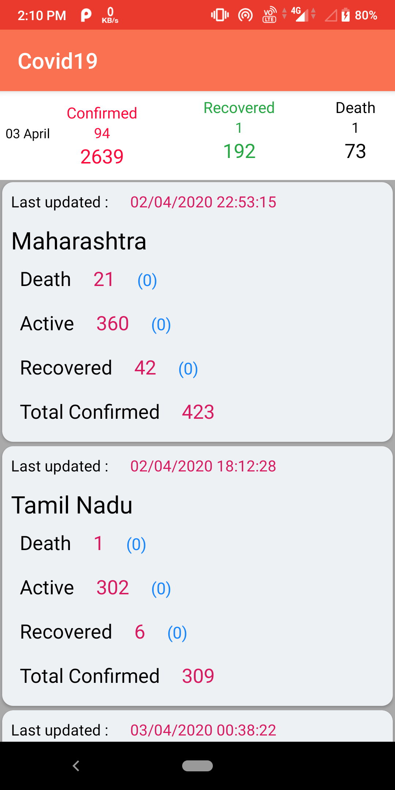
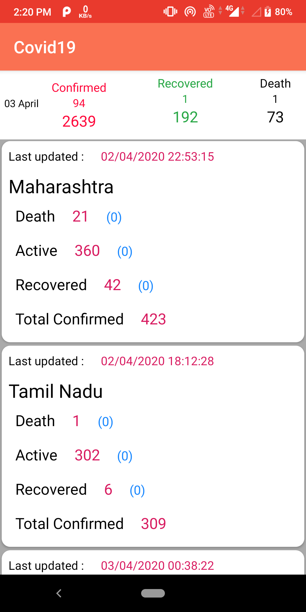

# Covid19
This app displays the COVID-19 statisticals details of individual states of India in a very simple way. It fetches data from official APIs and parse the JSON into RecycleView.

## Purpose :- 

1. To know the correct information about no. of recovered, died, confirmed patients of COVID-19 in states of India.
2. Understand JSON parsing

<!-- ## Screenshot :-

 -->

### Dependencies :-
```
implementation 'com.android.volley:volley:1.1.1'
implementation 'androidx.recyclerview:recyclerview:1.1.0'
implementation 'androidx.cardview:cardview:1.0.0'
```
Add them in app level gradle file.

## Bugs and Improvements :-
No bugs.

# Dev :- Prakash Gupta

